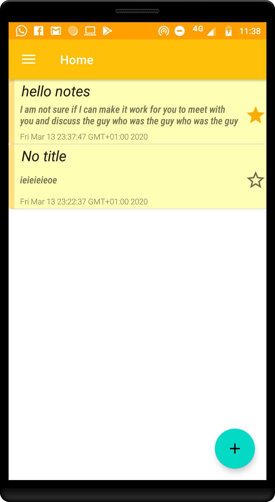
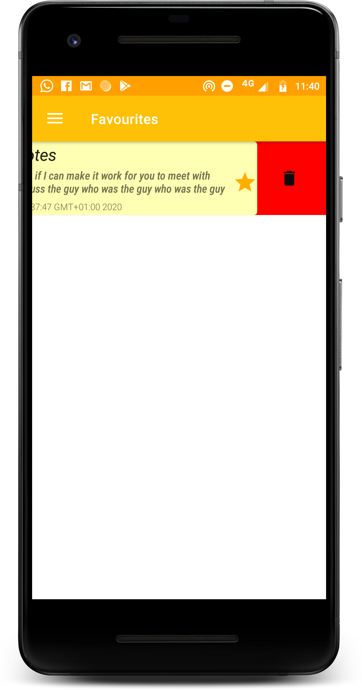
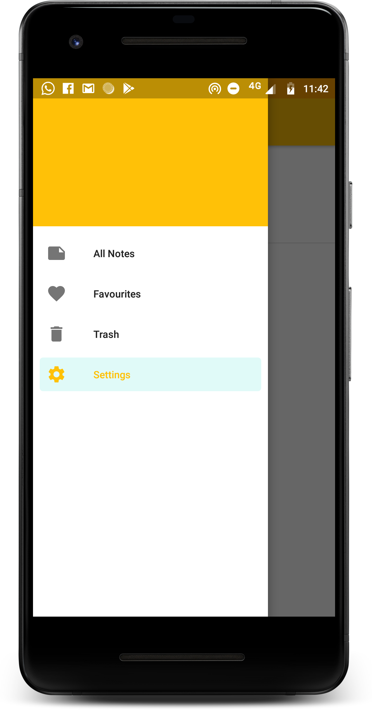
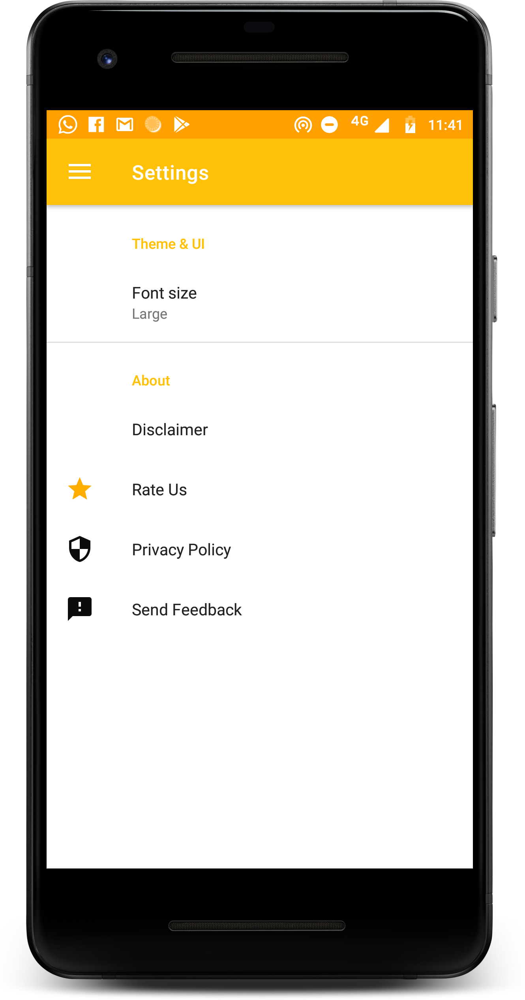

# Notes
Android Basic NotePad Application
* Dependency Injection (Dagger android)
* MVVM Architecture
* Android JetPack(ROOM,LiveData,Navigation Component,Databinding etc...)
* DataBinding
* Coroutine
* SafeArgs
* Material Component

  

