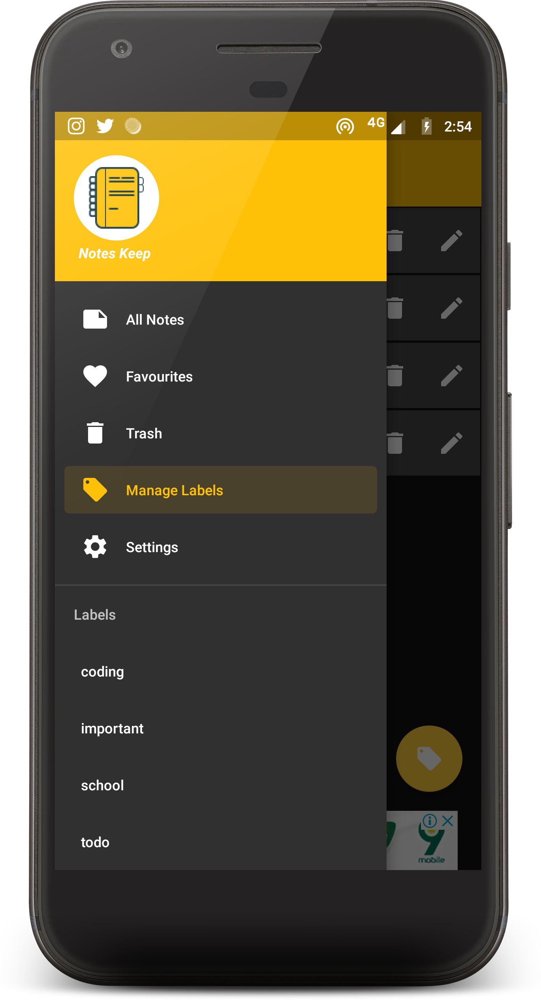
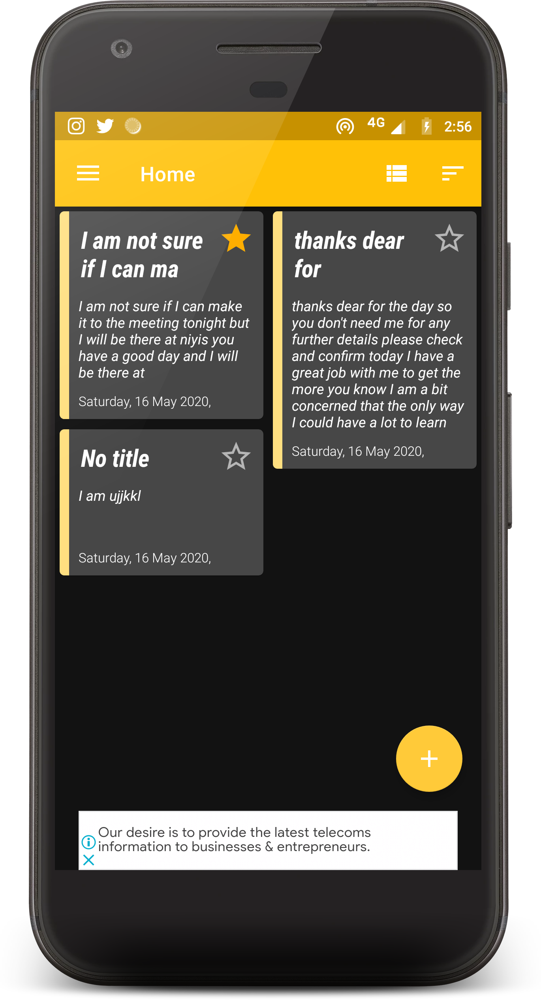
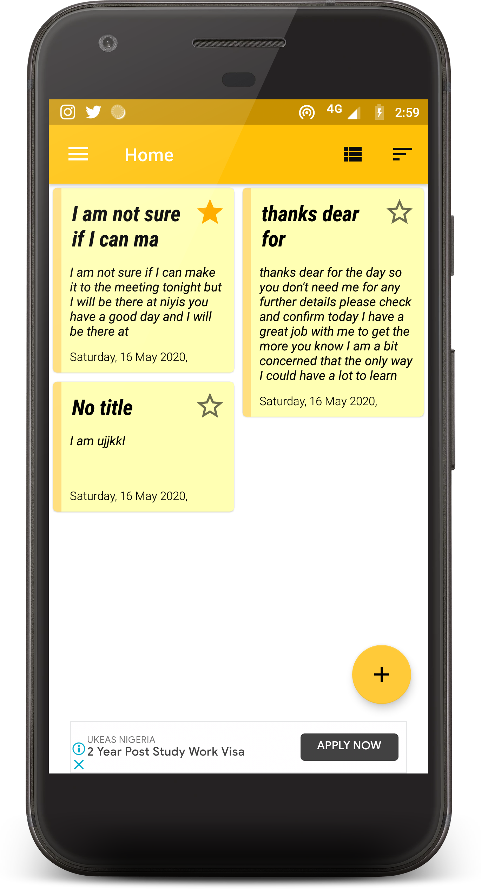
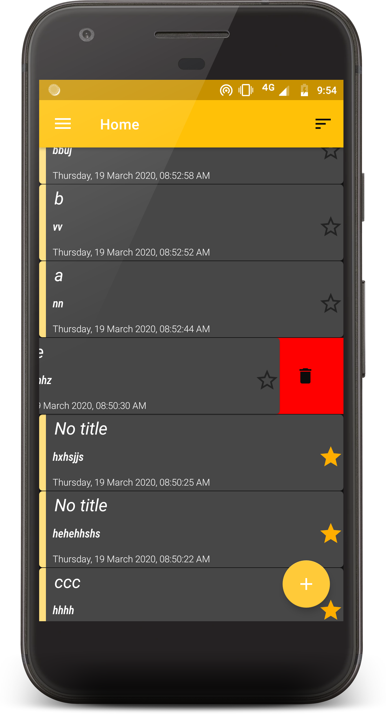
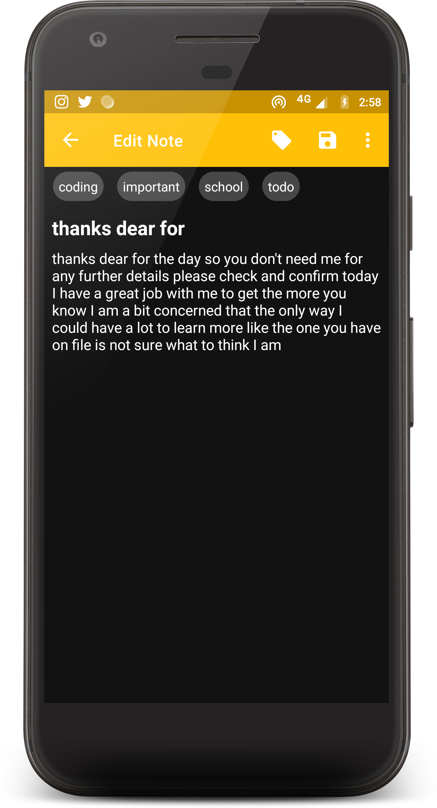
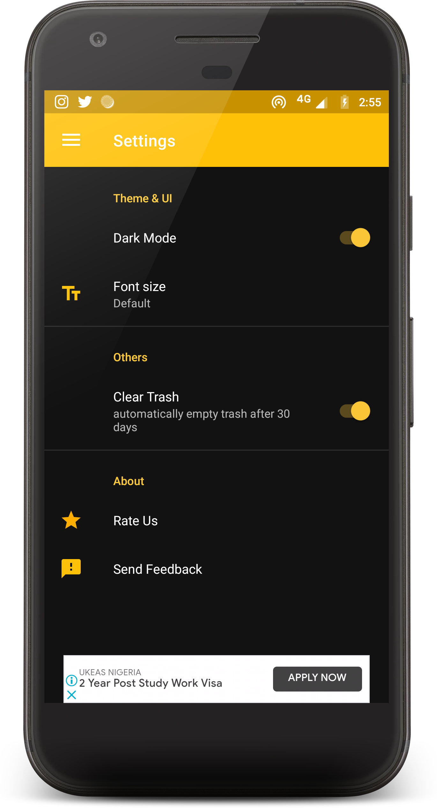
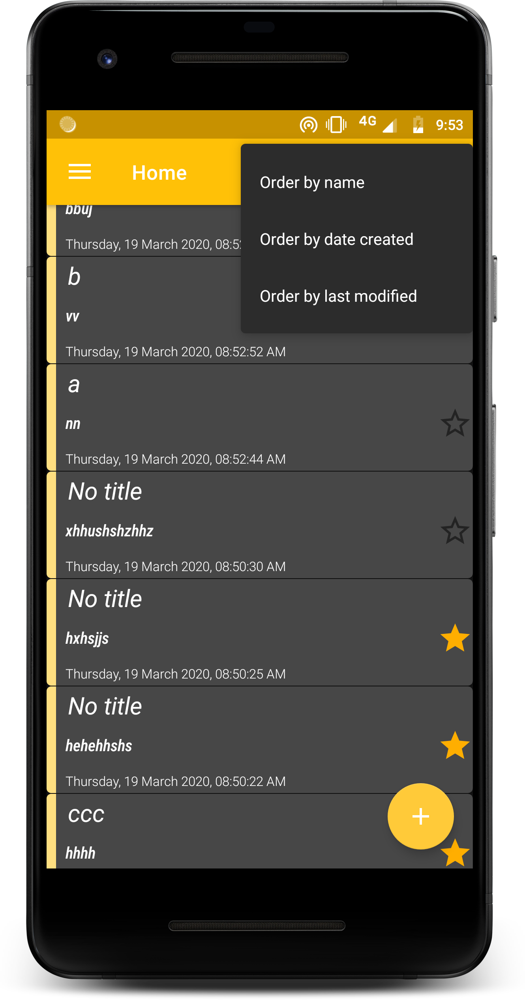

# Notes
Android Basic NotePad Application
* Dependency Injection (Dagger android)
* MVVM Architecture
* Android JetPack(ROOM,LiveData,Navigation Component,Databinding, WorkManager)
* DataBinding
* Coroutines
* SafeArgs
* Material Component
* Dark Mode
* Preference Fragment

  

 

